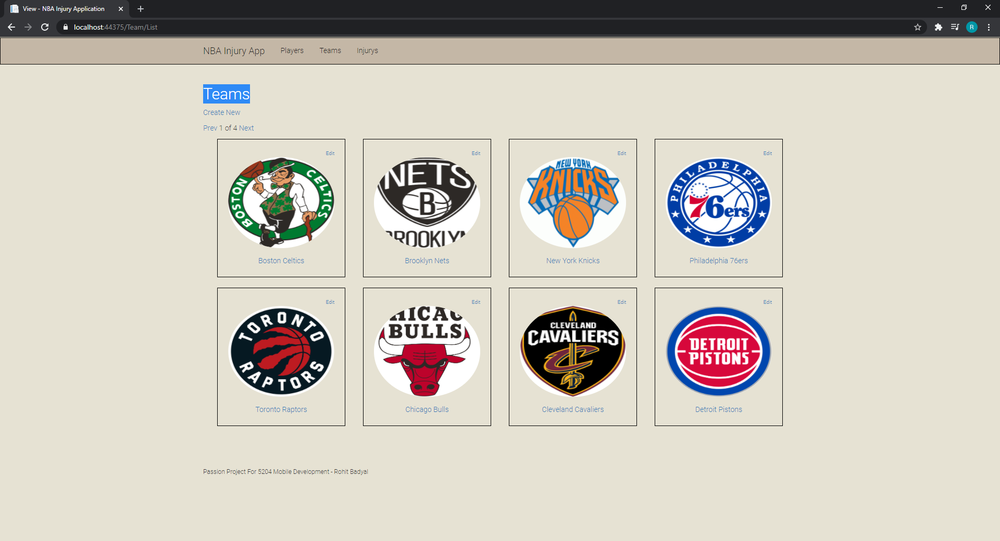

<strong>Passion Project Final Version </strong> 
NBA Injury App  
I made an injury application for the NBA, you can track what players have what injury and it descriped the injury and how long they can be out for.  
The database consist of three tables: Teams, Players and Injuries  
The application demonstrates a full MVP functionality with CRUD (Create, Read, Update and Delete) for each of the tables.  
Additionally, the extra feature I chose to do was an image upload but i created it for Teams and Players, so it looked more finished.  

